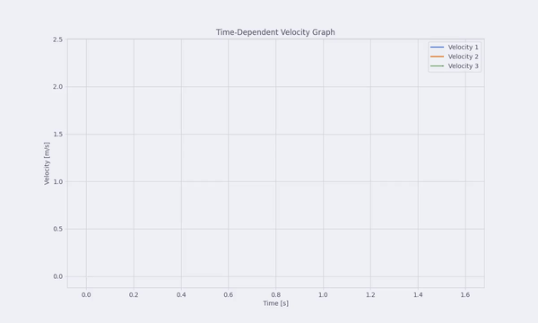
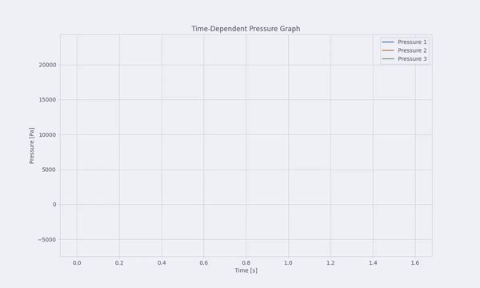
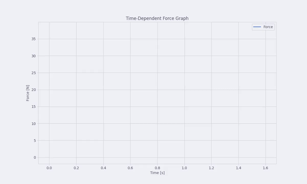

# Bi4 Binary File Reader

## Описание

Bi4 Binary File Reader - это инструмент для чтения и анализа бинарных файлов формата Bi4. Он позволяет извлекать данные, представленные в бинарном формате, и преобразовывать их в удобочитаемый вид.

## Установка

Для установки Bi4 Binary File Reader выполните следующие шаги:

1. Склонируйте репозиторий:

   ```bash
   git clone https://github.com/OREShake/bi4-reader.git
   ```

2. Перейдите в директорию проекта:

   ```bash
   cd bi4-reader
   ```

3. Установите необходимые зависимости:
   ```bash
   pip install -r requirements.txt
   ```

## Использование

Для чтения бинарного файла формата Bi4 используйте следующий пример кода:

```python
from bi4_reader import Bi4Reader

# Создание экземпляра Bi4Reader
reader = Bi4Reader('path/to/your/file.bi4')

# Чтение данных
time = reader.read_bi4_time()
number_of_particles = reader.read_number_of_particles()
properties = reader.read_properties()

# Вывод данных
print(properties)
```

Вы также можете запустить файл example.py, чтобы увидеть полный пример использования:

```bash
python example.py --file number (0-10)
```

## Пример анализа Dam Break

<figure>
    
    <figcaption>Визуализация Dam Break в Nvidia Index</figcaption>
</figure>

<table border=0 align=center>
	<tbody>
		<tr>
			<td width="10%" align="center">График скорости</td>
			<td width="90%" align="center">  </td>
		</tr>
        <tr>
			<td width="10%" align="center">График давления</td>
			<td width="90%" align="center">  </td>
		</tr>
        <tr>
			<td width="10%" align="center">График силы</td>
			<td width="90%" align="center">  </td>
		</tr>
	</tbody>
</table>

## Лицензия

Этот проект лицензирован под MIT License. Подробности можно найти в файле [LICENSE](LICENSE).
